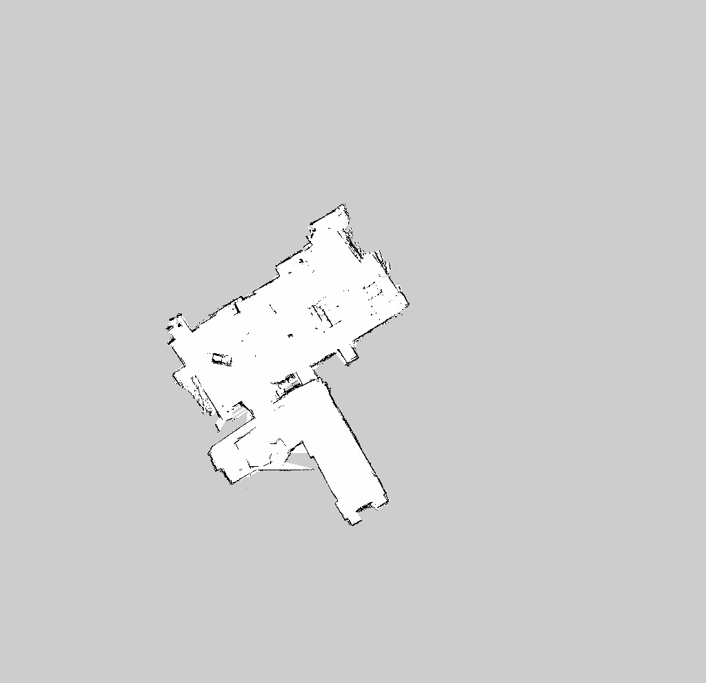

# Kobuki-SLAM
## Simultaneous Localization and Mapping (SLAM) using Kobuki Turtlebot 2

Map of Autonomous Control Engineering (ACE) - West Campus Laboratory was created using Simultaneous Localization and Mapping (SLAM). 

### Hardware:
1. Yujin Robot Kobuki TurtleBot 2 http://kobuki.yujinrobot.com/
2. Asus Xtion PRO RGB-D Camera https://www.asus.com/3D-Sensor/Xtion_PRO/
3. ODROID-XU4 Octa Core ARM Microcomputer http://www.hardkernel.com/main/main.php

### Software:
1. Ubuntu 14.04 Trusty Tahr http://releases.ubuntu.com/14.04/
2. Robot Operating System (ROS) Indigo http://wiki.ros.org/indigo/Installation

### ROS Packages used:
1. openni2_launch http://wiki.ros.org/openni2_launch
2. depthimage_to_laserscan http://wiki.ros.org/depthimage_to_laserscan
3. gmapping http://wiki.ros.org/gmapping

### Implementation:

Two new ROS packages named kobuki_slam and Kobuki_tf were created. kobuki_tf broadcasts the transform between base_link and camera_link of Kobuki Turtlebot.

  

