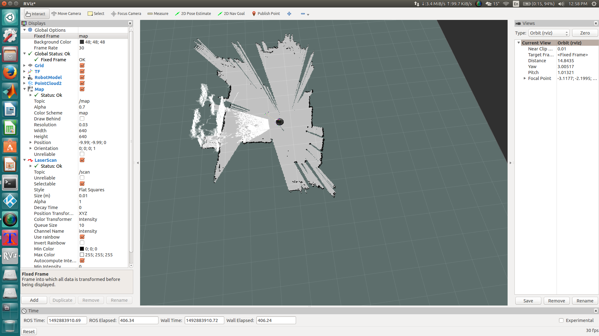
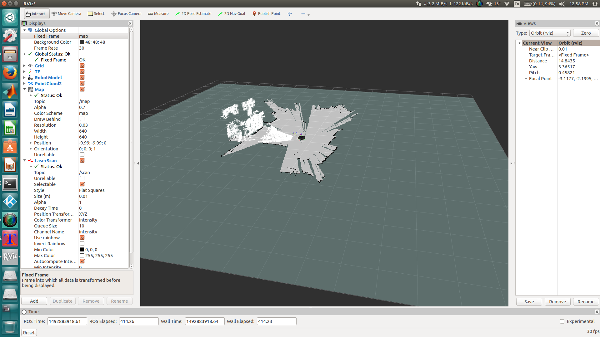
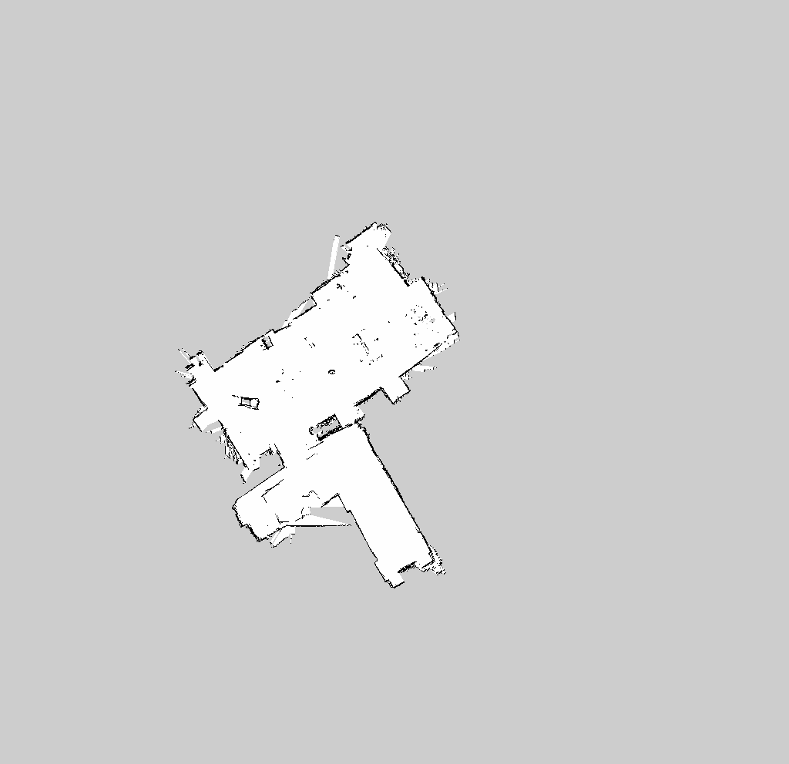

# Kobuki-SLAM
## Simultaneous Localization and Mapping (SLAM) using Kobuki Turtlebot 2

Map of Autonomous Control Engineering (ACE) - West Campus Laboratory was created using Simultaneous Localization and Mapping (SLAM). 

### Hardware:
1. Yujin Robot Kobuki TurtleBot 2 http://kobuki.yujinrobot.com/
2. Asus Xtion PRO RGB-D Camera https://www.asus.com/3D-Sensor/Xtion_PRO/
3. ODROID-XU4 Octa Core ARM Microcomputer http://www.hardkernel.com/main/main.php

### Software:
1. Ubuntu 14.04 Trusty Tahr http://releases.ubuntu.com/14.04/
2. Robot Operating System (ROS) Indigo http://wiki.ros.org/indigo/Installation

### ROS Packages used:
1. openni2_launch http://wiki.ros.org/openni2_launch
2. depthimage_to_laserscan http://wiki.ros.org/depthimage_to_laserscan
3. gmapping http://wiki.ros.org/gmapping

### Implementation:

The ODROID microcomputer can run the SLAM but adds a significant level of latency to the operations of the robot. The time to scan a small area is found to be higher using the on-board microcomputer, so a general purpose consumer laptop is used to supplement the robot’s on-board computer. ROS is used to facilitate the connectivity between the microcomputer and the laptop. Software developed using the ROS middleware only needs to be aware of the IP Address of the microcomputer to subscribe to the camera topic.

The Kobuki robot is accessed through the laptop over Wi-Fi using SSH.
```
ssh -X odroid@<ip address>
```
After successfully logged into the Kobuki through the laptop, ROS launch file `robot_with_tf.launch` is executed first to bring up the robot model and start the basic nodes of the robot. The robot keyboard controller launch file `keyop.launch` provides control for robot navigation using keyboard while scanning the environment.
```
roslaunch kobuki_node robot_with_tf.launch
roslaunch kobuki_keyop keyop.launch
```

Two new ROS packages named `kobuki_slam` and `kobuki_tf` were created for this project. `kobuki_tf` broadcasts the transform between `base_link` and `camera_link` of Kobuki Turtlebot. `kobuki_slam` is used for creating the map using on-board Asus Xtion RGB-D camera. The SLAM process is initiated from the laptop by executing the launch file of `kobuki_slam`.
```
roslaunch kobuki_slam kobuki_slam.launch
```
The `kobuki_slam.launch` file contains code to search and activate OPENNI2 ROS launch file `openni2.launch` which is used to connect to OpenNI-compliant devices such as the Asus Xtion. After the camera feed is running, `depthimage_to_laserscan` package is executed, remapping the subscribed topic from _image_ to _/camera/depth/image_raw_. `depthimage_to_laserscan`  takes a depth image and generates a 2D laser scan based on the provided parameters and publish it under _scan_ topic. `tf_broadcaster.cpp` script from `kobuki_tf` ROS package will be initiated through the SLAM launch file. After all the requried nodes and topics are activated, `gmapping` ROS package is activated. Some of the parameters of `gmapping` were changed from its default values for this project.

* _~map_update_interval_ (default: 5.0): How long (in seconds) between updates to the map. Lowered from 5.0 to 0.5, since the SLAM process is run on a laptop with decent computational power.
* _~maxUrange_ (default: 80.0): The maximum usable range of the laser. Changed to 10.
* _~linearUpdate_ (default: 1.0): Process a scan each time the robot translates this far. Changed to 0.001.
* _~angularUpdate_ (default: 0.5): Process a scan each time the robot rotates this far. Changed to 0.002.
* _~temporalUpdate_ (default: -1.0): Process a scan if the last scan processed is older than the update time in seconds. A value less than zero will turn time based updates off. Changed to 0.5.
* _~particles_ (default: 30): Number of particles in the filter. Increased to 500.
* Initial Map Size
  * _~xmin_:Changed from -100.0 to -10.0
  * _~ymin_:Changed from -100.0 to -10.0
  * _~xmax_:Changed from 100.0 to 10.0
  * _~ymax_:Changed from 100.0 to 10.0
* _~delta_ (default: 0.05): Resolution of the map. Changed to 0.03
* ~llsamplerange (default:0.01): Translational sampling range for the likelihood. Increased to 0.15.
* ~llsamplestep (default:0.01): Translational sampling step for the likelihood. Increased to 0.15. 
* ~lasamplerange (default:0.005): Angular sampling range for the likelihood. Increased to 0.55.
* ~lasamplestep (default:0.005): Angular sampling step for the likelihood. Increased to 0.55.


The scanning and map created can be viewed in Rviz. Rviz subscribes to _map_ topic published from `gmapping` ROS package. 

<p align="center">
   

   
</p>

The kobuki is moved around the environment using `keyop` for mapping. After mapping is finished, the created map can be saved to a file using `map_saver` service.
```
rosrun map_server map_saver
```
This will save the map to a file in your home directory called map.pgm. Map created after scanning ACE West Campus Lab:

<p align="center">
  
</p>

Reference: https://github.com/oroca/oroca-ros-pkg
